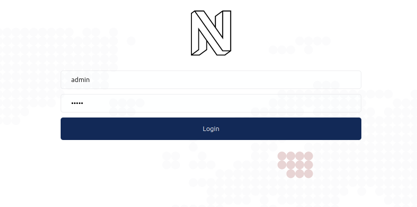
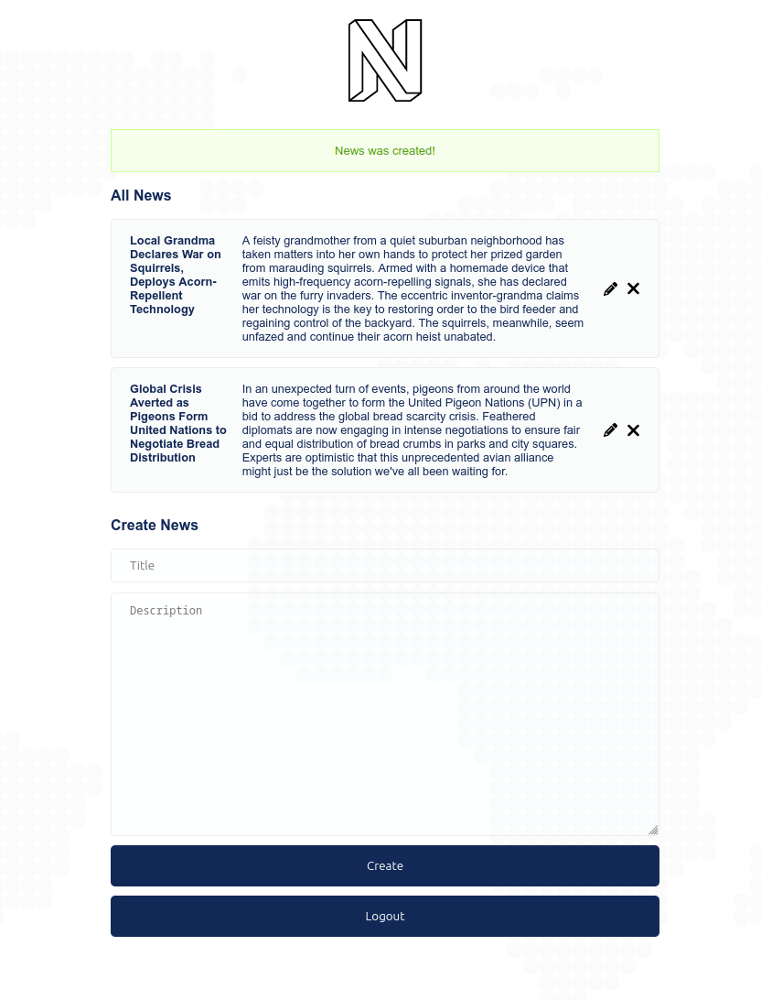

# About
Simple vanilla PHP, JS, HTML and CSS news managing web application implementing MVC pattern. Enjoy! 😃

 

# Prerequisites
- Docker compose installed on your machine
- Bash shell

# How to run
- Clone this repository
- Run `docker-compose up -d --build`
- Run `./bin/composer.sh install` to install composer dependencies inside the container
- Run `./bin/import_db_schema.sh` to import database schema
- Go to http://localhost:65090/ to see the application
- Login with sample user credentials: `admin` / `admin`

# Configuration
## Server
You can change server port binding by editing the `compose.yml` file and `mysql.env`. Change port binding for `frankenphp` service and
`SERVER_NAME` accordingly inside `franken.env`. For more information about FrankenPHP configuration, please refer to the https://frankenphp.dev/.
## Database
You can change port binding for MySQL service by editing the `compose.yml` file.
You can change database credentials by editing the `mysql.env` file. 
For more information about MySQL configuration, please refer to the https://hub.docker.com/_/mysql.
## App configuration
App configuration is stored inside `app/config` directory.
